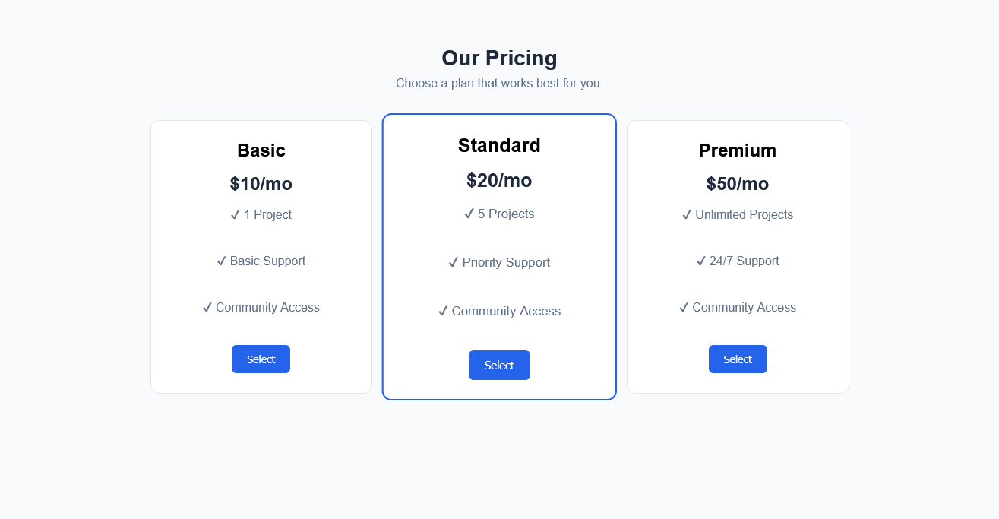
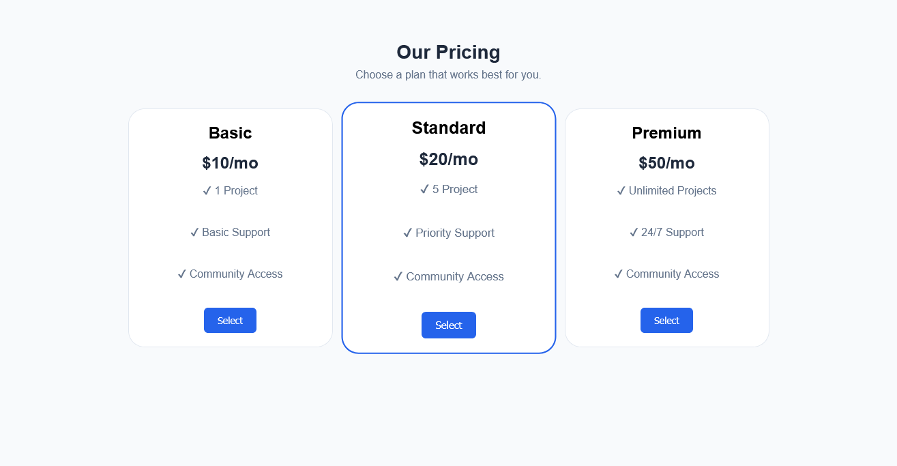

# Project 3 - Login Page

## Description
A Product Pricing Table project for me to practice:
Multi-column layout

Spacing between cards

Highlighting one card (featured)

Consistent typography

Flexbox and Gridbox (I choose flexbox, Grid sounds easy but mathematical.)

## Features
- Cards
- Transform
- Transition

## Screenshots

## Technologies Used
- HTML
- CSS

## How to Run
1. Clone the repository
2. Open `Index.html` in your browser
3. Enjoy!

## Live Demo
I really dont know how to do that in a multilayer repository.